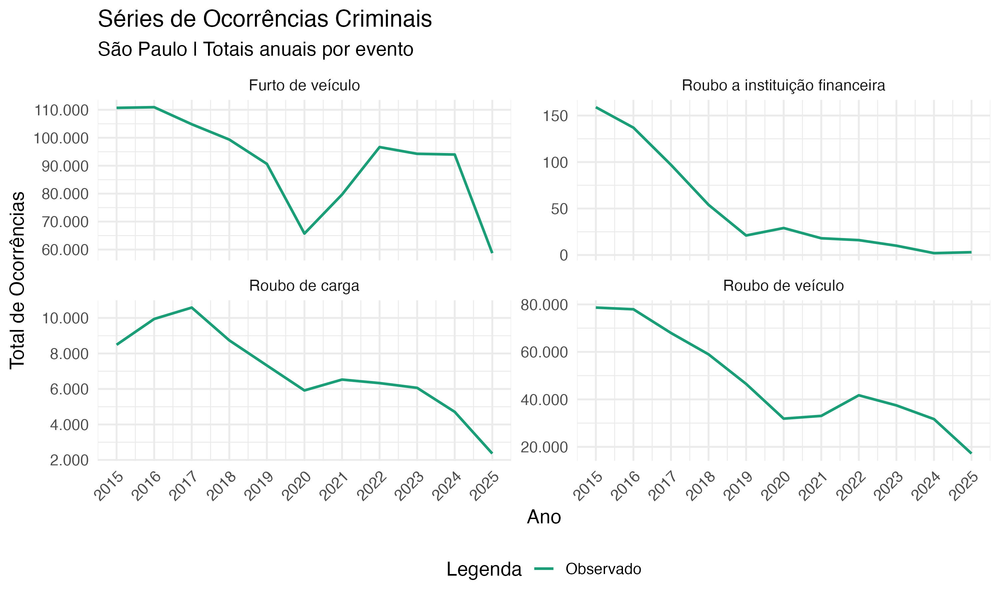
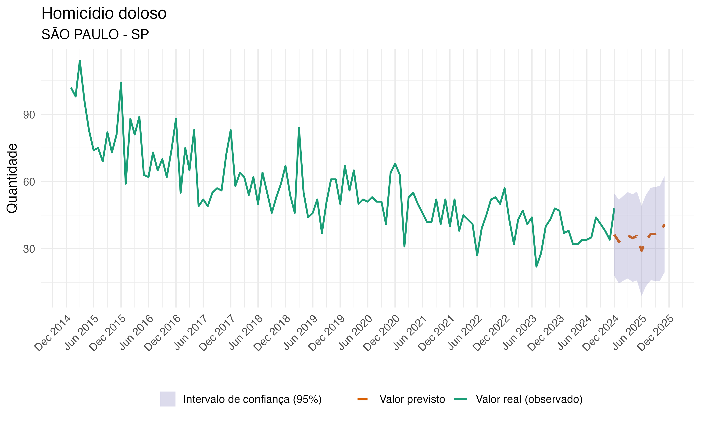

Summary
`BrazilCrime` is an open-source R package that provides streamlined access to public data maintained by the National Secretariat of Public Security of Brazil’s Ministry of Justice and Public Security. Covering data from 2015 onward, the package supports the extraction, organization, visualization, and analysis of crime and violence data in Brazil, with flexible filtering by geographic unit, time period, crime category, and temporal aggregation. It also includes tools for exploratory analysis and automated univariate time-series forecasting based on customized ARIMA models.

Statement of need
Brazil continues to be a country with a high prevalence of lethal violence, with a recent annual tally of more than 45,000 homicides, which corresponds to a rate of over 20 homicides per 100,000 inhabitants. This rate is considerably higher than the global average and predominantly affects young people, men, Black individuals, women in specific forms of violence such as femicide, and other vulnerable populations [@IPEA:2025]. Administrative public safety data are therefore central to research on crime, violence, criminal justice, and public policy in Brazil.
Despite the increasing utilization of administrative crime data in Brazil, the absence of standardized access to data from the Brazilian National Public Security Information System (SINESP) hinders replicability and cross-state comparability. This paper presents `BrazilCrime` [@Vargette:2025], a novel R package designed to facilitate the extraction and processing of public data, thereby enhancing the production of high-quality research and evidence-based public policies.


State of the field
Several open-source tools have improved access to public safety and crime data in specific contexts. The `crimedata` package provides access to open crime data for studies of crime and place [@Ashby:2018], while `ukpolice` supports access to police and crime data from the United Kingdom [@Odell:2019]. In Brazil, `ispdata` facilitates access to public security data from the state of Rio de Janeiro [@Laltuf:2023].
`BrazilCrime` complements these initiatives by targeting national Brazilian data made available through SINESP and by supporting both state-level and municipal-level workflows. Its main contribution is not the production of new substantive crime estimates, but the provision of software infrastructure that lowers the cost of reproducible empirical research using Brazilian public safety data. Compared with workflows based on manual downloads and ad hoc scripts, the package offers a standardized R interface, documented functions, and integration with common R tools for data manipulation, visualization, and forecasting.

Software design
`BrazilCrime` is conceived as a tool to facilitate the use of information produced in Brazil, allowing researchers both within and outside the country to access and work with public security data from states and municipalities more efficiently. The package was developed entirely in R, and it organizes and provides access to public data from SINESP, an integrated information platform maintained by the National Secretariat of Public Security of the Ministry of Justice and Public Security. The scope of the package is confined to the extraction of data and the facilitation of analysis within the R framework. The package's fundamental objective is to provide a conduit for empirical research. All data credits are the property of SINESP.
The package offers two core functions. The first, `get_sinesp_vde_data()`, retrieves data from the SINESP VDE database and allows users to filter by state, municipality, year, crime category, typology, and temporal granularity.
The second core function of the `BrazilCrime` package is `br_crime_predict`. The tool is grounded in the `auto.arima` function from the `forecast` package [@Hyndman:2025], which implements the Box and Jenkins methodology [@Box:2016]. The user can supply a time series to the function, thereby enabling the selection of various settings to determine how the search for the most appropriate autoregressive integrated moving average (ARIMA) model, whether seasonal or non-seasonal, will be conducted according to the characteristics of the data. This process will result in a predictive model for the variable of interest. The objective of this function is to facilitate both academic research and the development of technical reports and official notes on crime trends. This tool is particularly beneficial for researchers who are unfamiliar with univariate time-series forecasting models.
The following list enumerates the crime categories for which data are available. All variable names are presented in Portuguese, with their English equivalents provided below for reference.
```r
 [1] "Mandado de prisão cumprido" 
 [2] "Feminicídio"
 [3] "Homicídio doloso" 
 [4] "Lesão corporal seguida de morte"
 [5] "Morte no trânsito ou em decorrência dele (exceto homicídio doloso)" 
 [6] "Mortes a esclarecer (sem indício de crime)"
 [7] "Roubo seguido de morte (latrocínio)"
 [8] "Suicídio" 
 [9] "Tentativa de feminicídio"
 [10] "Tentativa de homicídio" 
 [11] "Arma de Fogo Apreendida" 
 [12] "Atendimento pré-hospitalar" 
 [13] "Busca e salvamento"
 [14] "Combate a incêndios" 
 [15] "Emissão de Alvarás de licença"
 [16] "Realização de vistorias" 
 [17] "Pessoa Desaparecida" 
 [18] "Pessoa Localizada" 
 [19] "Apreensão de Cocaína" 
 [20] "Apreensão de Maconha" 
 [21] "Tráfico de drogas" 
 [22] "Furto de veículo" 
 [23] "Roubo a instituição financeira" 
 [24] "Roubo de carga"
 [25] "Roubo de veículo" 
 [26] "Morte de Agente do Estado" 
 [27] "Suicídio de Agente do Estado"
 [28] "Estupro" 
 [29] "Morte por intervenção de Agente do Estado" 
 [30] "Estupro de vulnerável" 

```
  
These variables are: (1) arrest warrants executed; (2) femicide; (3) intentional homicide; (4) bodily injury resulting in death; (5) traffic-related death (excluding intentional homicide); (6) deaths pending clarification, with no evidence of crime; (7) robbery followed by death; (8) suicide; (9) attempted femicide; (10) attempted homicide; (11) firearms seized; (12) pre-hospital care; (13) search and rescue; (14) firefighting; (15) issuance of permits; (16) inspections conducted; (17) missing persons; (18) persons located; (19) cocaine seizures; (20) marijuana seizures; (21) drug trafficking; (22) vehicle theft; (23) financial institution robbery; (24) cargo theft; (25) vehicle robbery; (26) death of a public security officer; (27) suicide of a public security officer; (28) rape; (29) death resulting from law enforcement intervention; and (30) rape of a vulnerable person.

The following example retrieves annual state-level criminal incident data for São Paulo and plots selected incident categories using `ggplot2` [@Wickham:2016].
```r
library(BrazilCrime)
library(dplyr)
library(ggplot2)

sp_anuais <- get_sinesp_vde_data(
  state = "SP",
  category = "ocorrencias",
  granularity = "year"
) |>
  group_by(uf, ano, evento) |>
  summarise(total_ocorrencias_ano = sum(total, na.rm = TRUE), .groups = "drop")

ggplot(sp_anuais, aes(x = ano, y = total_ocorrencias_ano, color = "Observed")) +
  geom_line(linewidth = 0.9, na.rm = TRUE) +
  labs(
    title = "Series of Criminal Incidents",
    subtitle = "São Paulo | Annual totals per event",
    x = "Year",
    y = "Total incidents",
    color = "Legend"
  ) +
  scale_color_manual(values = c("Observed" = "#1B9E77")) +
  facet_wrap(~evento, scales = "free_y") +
  theme_minimal(base_size = 14)
```

\
The package can also be used for automated forecasting. The following code retrieves monthly intentional homicide data for the municipality of São Paulo from January 2015 to December 2024 and forecasts the subsequent 12 months.
```r
hmcd_sp <- get_sinesp_vde_data(
  state = "sp",
  city = "são paulo",
  year = 2015:2024,
  category = "vitimas",
  typology = "homicídio doloso"
)

br_crime_predict(dados = hmcd_sp, ts_col = "total_vitima")
```
In the example used for this paper, the automated procedure selected a seasonal ARIMA model, `ARIMA(0,1,1)(2,0,0)[12]`, and generated the forecast shown in Figure 2. The example is illustrative and should not be interpreted as a substantive claim about future crime levels.

\
Additional scripts illustrating the use of the package and the underlying data are available in a REDU repository [@REDU:2025], including examples associated with the working paper by @Geraldini:2025.


Research impact statement
Since its publication on CRAN in July 2024, `BrazilCrime` has recorded approximately 8,000 downloads (1 April. 2026).  The monthly average of approximately 544 downloads indicates that, in addition to disseminating data on criminal incidents and other forms of violence, ensuring expeditious and organized access to these data is imperative for researchers who depend on them to produce scientific knowledge capable of informing evidence-based public policies.
The package has three main contributions. First, it reduces the time needed to obtain comparable crime and violence indicators across Brazilian states and municipalities. Second, it facilitates reproducible research by allowing users to document data extraction steps directly in R scripts. Third, it provides entry-level forecasting tools that can support exploratory analysis, teaching, technical reporting, and policy-oriented monitoring of crime trends.

Ethics approval and consent to participate
This study relies exclusively on publicly available, aggregated secondary data provided by the Brazilian National Public Security Information System (SINESP). No individual-level or identifiable data were accessed. Under Brazilian regulations and institutional guidelines, ethics review board approval was not required.

AI usage disclosure
The authors used ChatGPT (GPT-5.5) and DeepL Write Pro for language editing, proofreading, and improvements to clarity. These tools were not used to make core software design or architectural decisions. The authors edited and validated the final manuscript and remain fully responsible for the manuscript.

Acknowledgements
Marcelo Justus acknowledges CNPq for the Productivity Grant associated with the project "Contributions to Public Security Research Using Brazilian Data" (grant no. 312685/2021-1), from which the `BrazilCrime` package was conceived. Giovanni Vargette acknowledges CNPq for the Undergraduate Research Scholarships received between 2023 and 2025. Bernardo Geraldini acknowledges CNPq for the Doctoral Scholarship (grant no. 142249/2024-6). This study was financed in part by CAPES, Brazil, Finance Code 001. The authors also thank colleagues who contributed suggestions for improvements and new package features.
References
